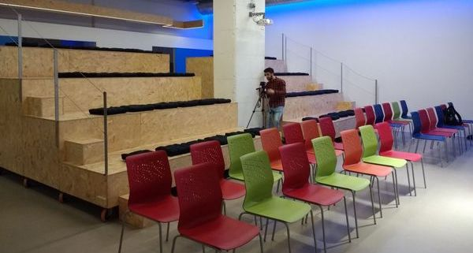
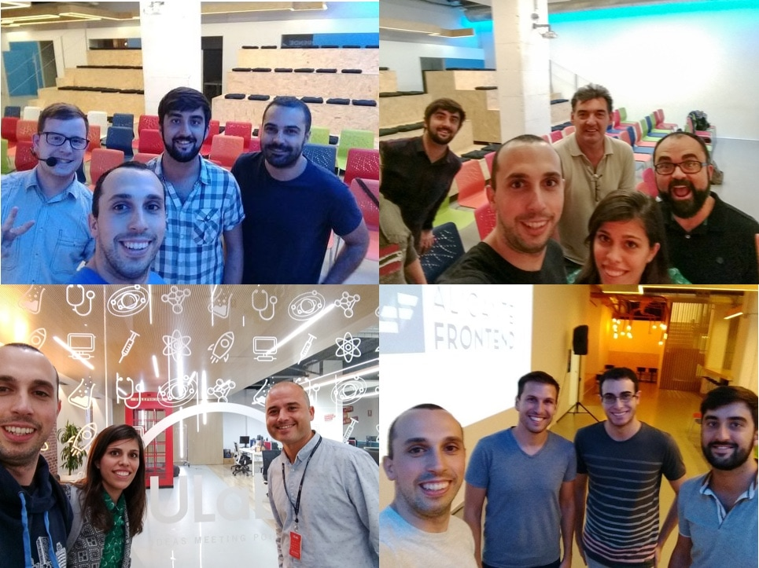
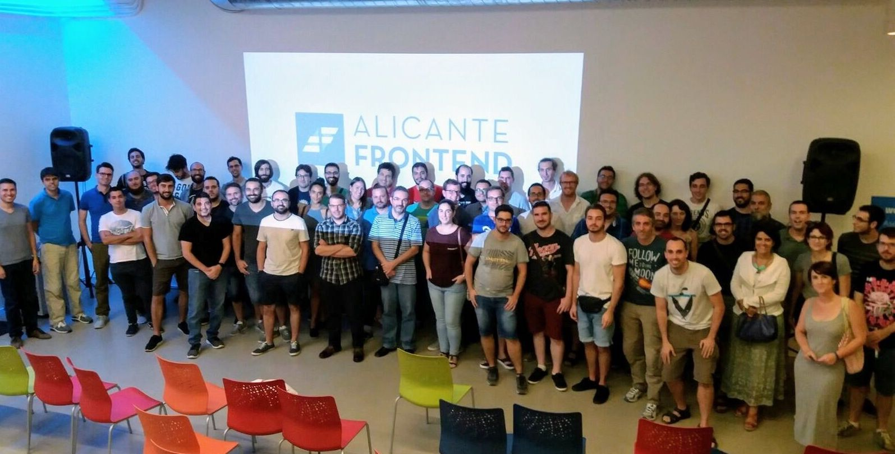
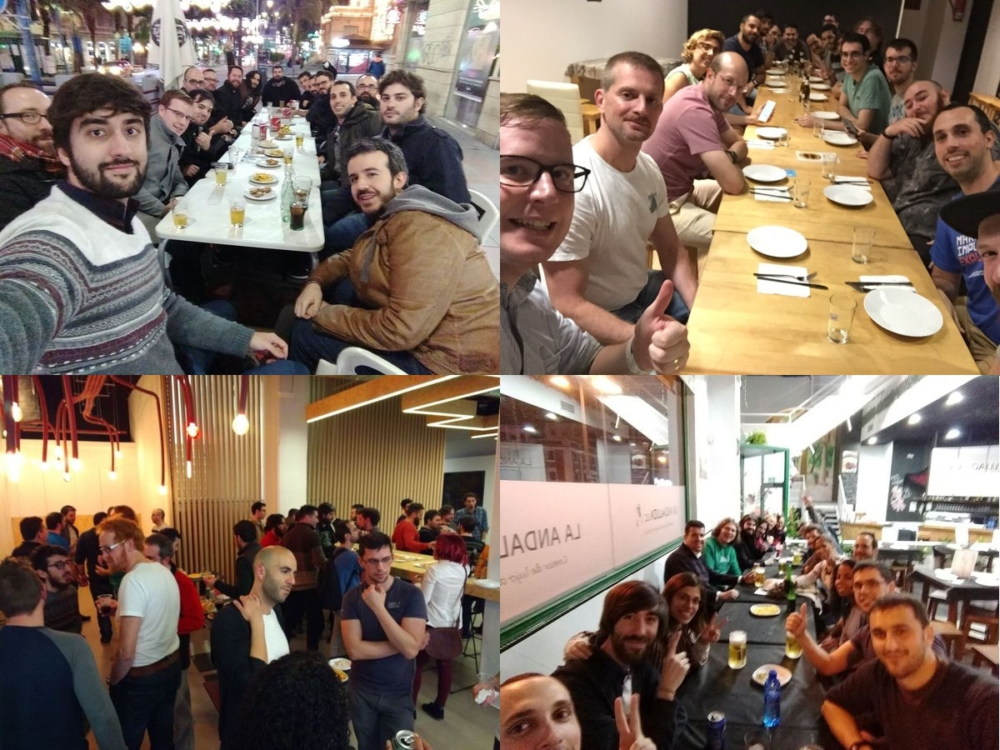

<!--  -->

One year ago, [Aaron](https://twitter.com/aarongarciah), [Alvaro](https://twitter.com/AlvYuste) and I started this amazing ride together. It's been a year of meeting lots of people and having lots of fun. Satisfaction, success and happiness are the words that come to my mind when I think of [Alicante Frontend](http://alicantefrontend.es/).

At the beginning, we were not sure about this success. Unlike bigger cities, Alicante didn’t have much community, apparently. Similar meetups from cities around had a stable 20-30 RSVP average. Still, we decided to make it happen even expecting less than 20 people attending.

Nowadays, it's a pretty cool community that had a great variety of events, surpassing 100+ RSVP and having international events. We've had all kind of fun stuff, such as raffles and food&drinks networking. You can find us on the following channels:

- [Meetup](https://www.meetup.com/preview/Alicante-Frontend)
- [Slack](http://alicantefrontend.herokuapp.com/)
- [Twitter](https://twitter.com/AlicanteFront)

## What's <b>Alicante Frontend</b> made of?

First of all, we needed a **regular place** to host the events. We were lucky to find [ULab](https://ulab.es/), a co-working center that made everything easy for us from the beginning. Not only allowing us to use the space, but also helping us preparing and promoting them.

At ULab, **speakers** come and share whatever they'd like to. They're core of the events, and very, very difficult to find. That's why we like to compensate them for their effort. Lately we've been consistently having speakers every month, which is great.

Usually, we get to the events a bit sooner so we start preparing it. We try to make some fun so the speakers relax and feel more comfortable.

Then, an organiser gives a sync-up intro where we share some news, announcements, decisions and other information about coming events. We like to be as transparent as possible in order to keep the community informed.

We had talks about JavaScript, functional (reactive) programming, building projects, Web performance, Web analytics, and even a workshop of Clojure. Special thanks to [Flavio Corpa](https://twitter.com/FlavioCorpa), [Ciro Ivan](https://twitter.com/FlavioCorpa), [Kikobeats](https://twitter.com/kikobeats), [Joaquin](https://github.com/joakin), [Jose Manuel Perez](https://twitter.com/jmperezperez) and [Laura Bonmati](https://twitter.com/laurabonmati) for their talks and keeping this community alive.

In Alicante Frontend we care about involving **companies**. We believe there is a need to improve the culture and mindset of local companies, and we believe we can make a change starting with the most talent resource: their employees. We mentor each other on technologies, workflows and best practices.

It's a win-win: companies get more visibility and qualified employees while employees feel more satisfied and productive by growing professionally and technically and meeting people in the community.

We hope this increases the visibility for foreign companies to come to Alicante, which means more and better job opportunities.

Thanks to the companies that help us, we can do all kind of cool stuff that requires a minimum amount of costs: having stickers, presents for the speakers, meetup's costs...

Last but not least, Alicante Frontend is its **people**. We all come to teach, to learn, to share, and more importantly to **have fun**. That's community, doesn't matter how many you are, what matters is to enjoy meeting new people, talking about how your work is, what you have been doing lately and share experiences in general. We all are a great family.

Part of that happens in the **networking**, right after the event. Here we surely have fun.

## The future

We'd like to keep up the hype and continue growing and improving this lovely community. Taking a retrospective view and matching our values, we have plenty of cool ideas we want to try out next year:

- **Have more fun! Hands-on events**: knowing how difficult is to find speakers around here, and how fun people consider "practical" events, we'll probably organise more workshop/hackaton-like events. Ideas: _Code in the Dark, Open Hacking (featuring Open Source), Katas..._
- **Bring speakers**: we'd like to bring somehow known speakers from outside Alicante, having a sponsor covering the costs. We already have one confirmed for next year, so stay tuned! :)
- **Conference**: Alicante is a very convenient place for a conference, in terms of connections, weather and standard of living. That's proven by the success of [React Alicante](http://reactalicante.es/). However, this is not something we can rush to do: organising a conference requires an extremely amount of time, energy and dedication, and we don't have that much (we have lives aside from work and Alicante Frontend), so we need to make sure we can commit to it, and if we do, to enjoy it. For that reason, we cannot make sure this will happen this year. **Would you like to be part of this?** We'll need help for sure, so don't hesitate in contacting us.

Any other ideas? Please tell us!

We hope you get an overview of what Alicante Frontend is and what our values are. We wish this community to keep up growing and improving, bringing more people and companies together. We're excited and doing our best to improve the Web community in Alicante! So if you haven't come and visited us, what are you waiting for?
