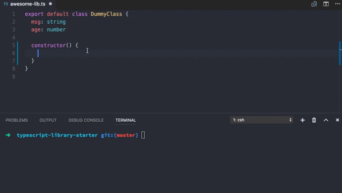

**_Wait, a video explaining "Use Prettier with TSLint"?_ Yes! Check it out on [Egghead.io](https://egghead.io/lessons/typescript-use-prettier-with-tslint-without-conflicts-c39670eb)!**

Recently, [@vjeux](https://twitter.com/Vjeux), one of the authors of Prettier, announced TypeScript support in the following tweet:

<ClientOnly>
  <Tweet id="870670634908475392"/>
</ClientOnly>

That's pretty amazing! I've just went and tried it out. I was so impressed by how magic the experience was that I've [completely removed TSLint](https://twitter.com/alexjoverm/status/871765191721197568) from [TypeScript library starter](https://github.com/alexjoverm/typescript-library-starter).

## The problem

Prettier and TSLint collide, since they both take care of formatting. For the following code, TSLint will give us the error `[tslint] Multiple spaces found before '{'. (no-multi-spaces)`:

```typescript
class DummyClass {
  food = "sandwitch";
}
```

But, when we run Prettier, the code is automatically formatted:

```typescript
class DummyClass {
  food = "sandwitch";
}
```

This makes the workflow pretty useless, since we're getting linting errors that Prettier will solve.

## The solution

It's very simple:

> Let Prettier take care of code formatting, and TSLint of the rest

That's why I've created [tslint-config-prettier](https://github.com/alexjoverm/tslint-config-prettier). It disables all TSLint formatting related rules, as well as for [tslint-react](https://github.com/palantir/tslint-react) and [tslint-eslint-rules](https://github.com/buzinas/tslint-eslint-rules).

The installation is straightforward, once you setup [TSLint](https://palantir.github.io/tslint/) and [Prettier](https://github.com/prettier/prettier):

```bash
npm i -D tslint-config-prettier
```

Add it to the end of your `tslint.json` file:

```json
{
  "extends": ["tslint:latest", "tslint-config-prettier"]
}
```

Now we can use Prettier and TSLint without any problem!



I must thank [@vjeux for pointing me out](https://twitter.com/Vjeux/status/871796320792608768) to this solution and [@JBlack](https://twitter.com/JBlaak) for the time to [review tslint-config-prettier](https://github.com/alexjoverm/tslint-config-prettier/pull/1).
