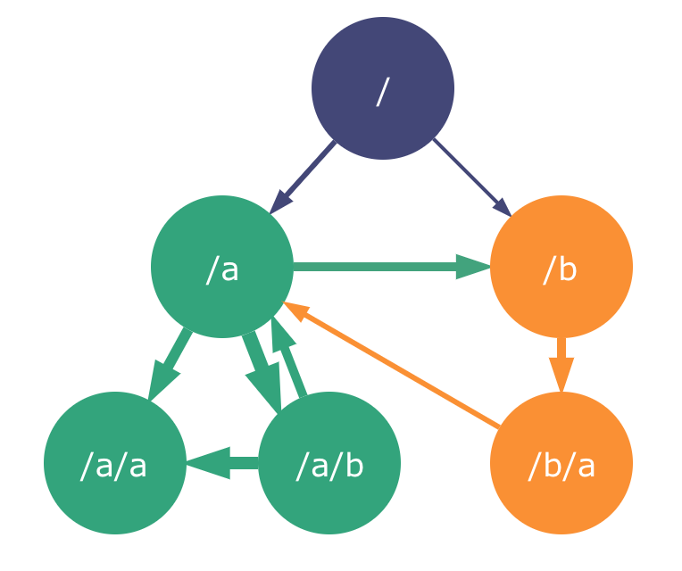

# Zero Config y Machine Learning aplicado al "bundling" de Web Apps

En el mundillo del desarrollo web, tenemos la suerte y el problema de que todo cambia muy rápidamente. No sólo vemos tecnologías aparecer día a dia, sino también nuevos conceptos, paradigmas y prácticas.

Entonces vemos Zero Config, Machine Learning, Bundling... Pero, ¿Qué son todos estos palabrejos?

Supongo que el Machine Learning ya lo conocerás, y sobre el _bundling_... no encuentro otra forma de decirlo en español a ese agrupamiento que hacemos los web devs para que nuestros modulos de JavaScript acaben combinados de tal forma que el navegador los entienda.

## Zero Config

Si eres activo en twitter habrás visto este año cierta tendencia con el término de zero-config, especialmente con el hashtag [#0CJS](https://twitter.com/hashtag/0CJS).

Cuando se dice de que una herramienta es zero-config, esa herramienta está preconfigurada de tal forma que como usuarios de ella, no tenemos que configurar nada para empezar a usarla.

Ésto es una tendencia que se ha popularizado mucho, ya que la finalidad es dar un gran **DX** (Developer Experience), y que se está aplicando a la mayoría de herramientas modernas, no sólo en el área del bundling.

Algunos ejemplos son Prettier en el área del formateo o Jest y Cypress en la del testing.

Para que entiendas mejor que es el zero-config, veámos realmente lo que **no** es zero-config.

### Apps no zero-config

Prácticamente hasta el año pasado, 2017, crear una app de cero solía requerir de un tiempo de configuración inicial, en el que la mayor parte se iba definiendo la configuración de Webpack y otras herramientas para poder aumentar tu eficacia y productividad a la vez que presentabas una Web Apps optimizada de cara al usuario final.

¿Has configurado alguna vez Webpack para un caso de uso de Web App real? No voy a poner el código por no alargar el artículo, pero puedes ver un ejemplo en la [template original del antiguo vue-cli](https://github.com/vuejs-templates/webpack/blob/develop/template/build/webpack.base.conf.js), y eso es sólo una tercera parte de la configuración.

Cuando configuramos Webpack para hacer el _bundling_ de una Web App, las características que solemos necesitar son:

- Bundling de los módulos de JavaScript
- Compilación para usar las últimas características del lenguaje ECMAScript (Babel)
- Pre/post procesamiento de lenguajes derivados de CSS
- Compilación de JSX u otros lenguajes de template o DSLs
- Compilación de TypeScript o Flow en caso de que uses static typing
- Procesado de estáticos cómo fuentes, imágenes, etc
- Para **desarrollo**: dev-server con HMR (Hot Module Replacement), proxy para API, source maps...
- Para **producción**: minificación, mangling, hashing, code-spliting, tree-shaking y más optimizaciones
- Y otras cosas dependiendo de qué necesites o vayas a usar

Webpack utiliza loaders para procesar los assets recibidos y plugins para otro tipo de transformaciones. Para cada una de las características mencionadas, vas a tener que configurar mínimo un loader o plugin.

Como ves, es un trabajo muy **repetitivo** que además es casi identico entre apps. Es por eso que la gente empezaba a crear sus seeds o starters (yo inclusive con [typescript-library-starter](https://github.com/alexjoverm/typescript-library-starter)).

El problema, es que éstos podían convertirse en algo monstruoso, que por una parte te resolvían muchas cosas, pero por otra la curva de aprendizaje para entenderlo y empezar a usarlo es grandísima. Un ejemplo de ello es [react-boilerplate](https://github.com/react-boilerplate/react-boilerplate), que aunque incluya más cosas aparte del bundling, esa configuración [sigue estando ahí](https://github.com/react-boilerplate/react-boilerplate/blob/master/internals/webpack/webpack.base.babel.js).

### Alternativas zero-config

Como es lógico, se necesitaba una solución a esto, por lo que empezaron a crearse herramientas zero-config.

Una de las más populares es **[Parcel](https://parceljs.org)**, un bundler tan capacitado como Webpack que sólo requiere, literalmente, de instalarse y empezar a ser usado (yo lo llamo el fenómeno "Install & Run ™️"):

```
npm install parcel-bundler
parcel index.html
```

Lo único que necesita es un fichero de entrada, ya sea un fichero HTML, JS, etc. Y a partir de ahí construirá el árbol de dependencias de assets y aplicará **automáticamente** las transformaciones que sean necesarias.

Es decir, si en tu código detecta SCSS, JSX, ES2015+, Vue... lo transformará. En [este enlace](https://parceljs.org/assets.html#assets-supported-by-default) puedes ver la cantidad de formatos que puede transformar por defecto.

No sólo eso, sino que además todas las buenas prácticas para entornos de desarrollo y producción que hemos comentado más arriba.

Existen otras alternativas como [Poi](https://poi.js.org) (similar a Parcel) y [MicroBundler](https://github.com/developit/microbundle) (usada para librerías), pero que no vamos a detallar en este artículo, por lo que te animo a que les eches un vistazo.

## Machine Learning aplicado al bundling

Independientemente de si la solución es o no zero-config, cualquier optimización que podamos hacer a nivel de bundling y app, como el uso de resource hints o las técnicas de code-splitting y lazy-loading de rutas y componentes, **es estática**. Esto no es malo de per se: mejor tener optimizaciones estáticas que no tener optimización. Tristemente, a día de hoy no suelo ver mucho este tipo de optimizaciones que son factibles de forma casi gratuita.

Pero si nos paramos a pensar, cada aplicación es un caso diferente. ¿Y si pudieramos de manera inteligente optimizar las aplicaciones según su uso?

De ahí nace **[Guess.js](https://github.com/guess-js/guess)**, un toolkit desarrollado por grandes cómo [Minko Gechev](https://twitter.com/mgechev) y [Addy Osmani](https://twitter.com/addyosmani) que aplica data-driven bundling y loading. En otras palabras, utiliza Machine Learning para entrenar un modelo usando los datos de Google Analytics, y con ellos determinar cuáles son las rutas y componentse de la aplicación que son más probables de ser cargados según dónde se encuentre el usuario en ese momento.


En base a ello, Guess.js utilizará un bundling optimizado y aplicará el resource hint `preload` para hacer una precarga predictiva de los componentes que considere probables de ser usados.

Por ejemplo, imagina que tenemos 3 rutas: Home, Usuarios y Articulos. Si nuestros datos dicen que estando en Home, es probable qe el usuario navegue a Usuarios, Guess.js aplicará preload en Usuarios además de tenerlo en cuenta a la hora de hacer el bundling.

La forma en la que hace este bundling es agrupando los chunks (o pedacitos de JavaScript a los que se ha aplicado code-splitting) según el grado de conexión entre rutas o components. Esto es conocido como **chunk clustering**:



Aún estando en estado alpha, ya se han empezado a ver integraciones con las tecnologías y frameworks más populares como [Nuxt](https://twitter.com/nuxt_js/status/1037855174147166209?lang=en), [Next](https://twitter.com/mgechev/status/1036774136058601472?lang=en), [Gatsby](https://www.gatsbyjs.org/packages/gatsby-plugin-guess-js/) y [Angular](https://github.com/mgechev/guess-js-angular-demo).

No quiero indagar más en este artículo, ya que los detalles sobre Guess.js son algo más complejos, pero si tienes curiosidad, te recomiendo que leas el artículo **[Machine Learning Driven Bundling: The future of Javascript Tooling](https://blog.mgechev.com/2018/03/18/machine-learning-data-driven-bundling-webpack-javascript-markov-chain-angular-react/)** donde encontrarás otras **19 referencias al final de él** de lo más interesantes.

## Conclusión

Espero que con lo que hemos visto en este artículo seas más cosciente de lo que es el concepto de zero-config y de la cantidad de herramientas que tenemos hoy por hoy para no perder la semana configurando Webpack.

Sólo hemos visto herramientas zero-config en el área del bundling, pero recuerda que hay otras, como el formateo o el testing, donde también aplica y encontrarás herramientas.

Además, espero que estés al tanto de la evolución de Guess.js, ya que tiene pinta de ser lo que abra el camino al futuro de aplicar técnicas de Machine Learning al tooling de desarrollo de aplicaciones.

Si quieres ver una versión algo más extensa, hablé sobre esto en la charla [The new era of zero-config tools](https://www.youtube.com/watch?v=Zh8BAD418fI) en la [React Alicante 2018](http://reactalicante.es/).

Cualquier duda, no dudes en hablarme por [Twitter a @alexjoverm](https://twitter.com/alexjoverm)
